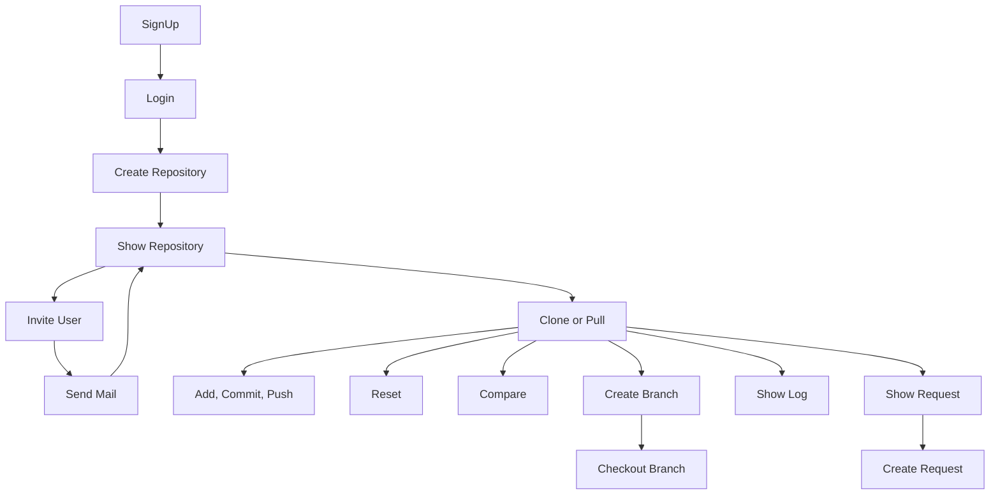
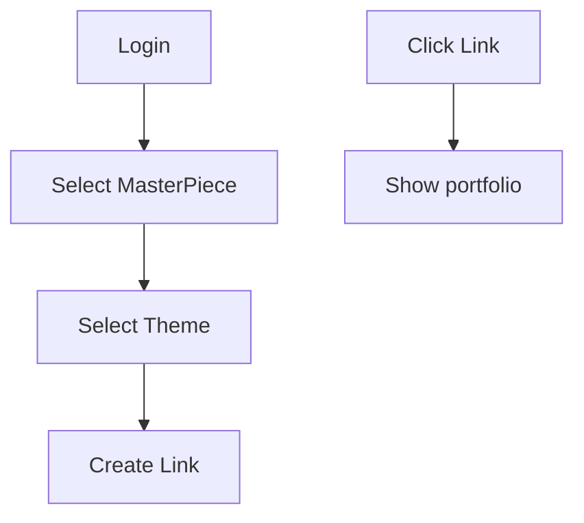

<div align='center' ><h1> ⋆⁺₊⋆ Clonet ⋆⁺₊⋆ </h1> </div>
            
<h4> 원격 저장소를 활용한 그림 협업 & 버전관리 툴</h4>

## 개발환경
#### 📱 APP 📱
   

#### 💻 WEB 💻
    
 


#### 🛠 TOOL 🛠
    


## Architecture


## Trello
https://trello.com/b/0S6KfZjD/caca
## Apollo
https://studio.apollographql.com/org/clonet/graphs

## To Run
```
cd Terraform
terraform init
terraform apply
terraform destroy
```

## Flow Chart
### APP

### WEB

## DB
https://dbdiagram.io/d/622854b261d06e6eadcb3436

## Git - Commit Message Convention
| Command  | Description |
| -------- | ----------- |
| **Feat** |새로운 기능을 추가할 경우|
|**Fix**|버그를 고친 경우|
|**Design**| CSS 등 사용자 UI 디자인 변경|
|**!BREAKING CHANGE**| 커다란 API 변경의 경우|
|**!HOTFIX**| 급하게 치명적인 버그를 고쳐야하는 경우|
|**Style**| 코드 포맷 변경, 세미 콜론 누락, 코드 수정이 없는 경우|
|**Refactor**| 프로덕션 코드 리팩토링|
|**Comment**| 필요한 주석 추가 및 변경|
|**Docs**| 문서를 수정한 경우|
|**Test**| 테스트 추가, 테스트 리팩토링(프로덕션 코드 변경 X)|
|**Chore**| 빌드 태스트 업데이트, 패키지 매니저를 설정하는 경우(프로덕션 코드 변경 X)|
|**Rename**| 파일 혹은 폴더명을 수정하거나 옮기는 작업만인 경우|
|**Remove**| 파일을 삭제하는 작업만 수행한 경우|
|**Merge**| 병합 충돌|


## Email
* pavi03@kpu.ac.kr
* pjy0619@kpu.ac.kr
* petitejini@kpu.ac.kr


## Our Email
clonet.caca@gmail.com

## Swift Prototype

